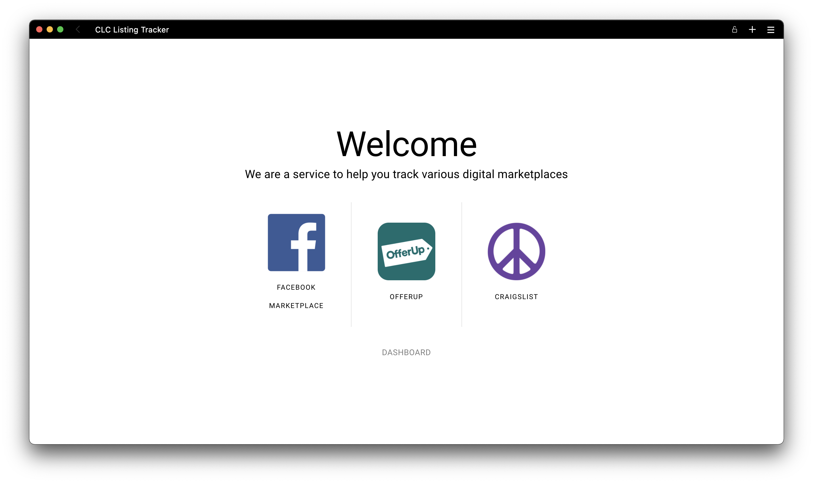

<h1 align="center">
  <br>
  <!-- <a href="http://www.amitmerchant.com/electron-markdownify"></a> -->
  <br>
  Comfy Living Chicago - Listing Tracker
  <br>
</h1>

<h4 align="center">A minimal listing tracker for various digital marketplaces.</h4>

<p align="center">
  <a href="#key-features">Key Features</a> •
  <a href="#how-to-use">How To Use</a>
</p>



## Key Features

- Support for Facebook Marketplace, Offerup, and Craigslist
- Dashboard for managing active queries

**Coming Soon: History**

## How To Use

First, you will need to create a .env file like the one below with the necessary environment variables

```
CRONITOR=
GMAIL_USER=
GMAIL_PASS=
PORT=3080
```

To clone and run this application, you'll need [Git](https://git-scm.com) and [Node.js](https://nodejs.org/en/download/) (which comes with [npm](http://npmjs.com)) installed on your computer. From your command line:

```bash
# Clone this repository
$ git clone https://github.com/sakeththota/clc-listing-tracker

# Go into the api repo
$ cd clc-api

# Install dependencies
$ npm install

# Go into the app repo
$ cd ../clc-app

# Install dependencies
$ npm install

```

Note: If you're using Linux Bash for Windows, [see this guide](https://www.howtogeek.com/261575/how-to-run-graphical-linux-desktop-applications-from-windows-10s-bash-shell/) or use `node` from the command prompt.
